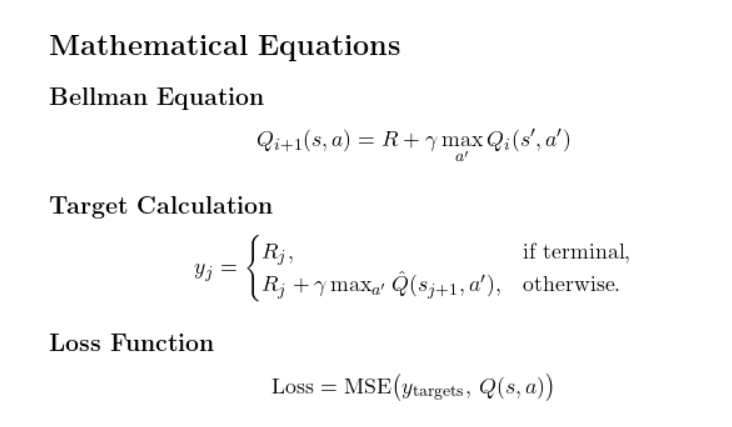

# Lunar Lander - Deep Q-Learning 

This project implements a Deep Q-Learning agent to solve the Lunar Lander environment from OpenAI Gym.

## Features

- **Deep Q-Network (DQN)**: Neural network to estimate \( Q(s, a) \).
- **Experience Replay**: Improves learning by sampling past experiences.
- **Target Network**: Enhances stability with a separate Q-value network.
- **Epsilon-Greedy Policy**: Balances exploration vs. exploitation.

## Mathematical Equations

## Dependencies

- **Python Packages**:
  - `gym`: Lunar Lander environment.
  - `numpy`: Numerical operations.
  - `tensorflow`: Neural network framework.
  - `imageio`: Video generation.
  - `pyvirtualdisplay`: Headless rendering.
- **System Dependencies**:
  - `xvfb`, `python-opengl`, `ffmpeg`: For display and video.
