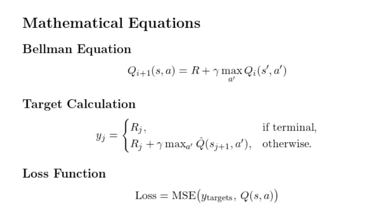

# Lunar Lander - Deep Q-Learning 

The goal of this project is to train an agent to safely land a lunar lander on a landing pad using reinforcement learning. The agent learns to control the lander's engines to adjust its trajectory, balance fuel efficiency, and avoid crashes. The environment is considered solved when the agent achieves an average score of 200 points over the last 100 episodes.

This project implements a Deep Q-Learning agent to solve the Lunar Lander environment from OpenAI Gym.

## Features

- **Deep Q-Network (DQN)**: Neural network to estimate \( Q(s, a) \).
- **Experience Replay**: Improves learning by sampling past experiences.
- **Target Network**: Enhances stability with a separate Q-value network.
- **ε-Greedy Policy**: Balances exploration and exploitation during training.

## Mathematical Equations

## Dependencies

- **Python Packages**:
  - `gym`: Lunar Lander environment.
  - `numpy`: Numerical operations.
  - `tensorflow`: Neural network framework.
  - `imageio`: Video generation.
  - `pyvirtualdisplay`: Headless rendering.
- **System Dependencies**:
  - `xvfb`, `python-opengl`, `ffmpeg`: For display and video.
